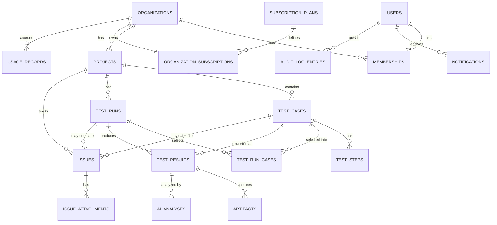

# Phase 1 Data Model: TestPilot AI

**Feature**: `001-testpilot-ai-platform` | **Date**: 2026-08-05

Derived from spec.md's Key Entities section and the Database Design principles in plan.md
(tenant scoping on every table, RLS-ready, denormalized counters for hot read paths). Types are
described conceptually (PostgreSQL types via SQLModel), not as SQLModel class bodies — actual
model code is an implementation task, not a planning artifact.

Every table below except `users`, `organizations`, `subscription_plans`, and
`audit_log_entries` (justified individually) carries:
- `id`: UUID, primary key, generated (`gen_random_uuid()`)
- `organization_id`: UUID, NOT NULL, FK → `organizations.id`, indexed
- `created_at`: timestamptz, NOT NULL, default `now()`
- `updated_at`: timestamptz, NOT NULL, default `now()`, updated on write

and has a Row-Level Security policy: `USING (organization_id = current_setting('app.current_org_id')::uuid)`.

---

## Entity Relationship Overview

---

## Core Identity & Tenancy

### `users`

Not organization-scoped (a user's account exists independent of any one Organization; scoping
happens via `memberships`).

| Column | Type | Constraints |
|---|---|---|
| id | UUID | PK |
| email | citext | UNIQUE, NOT NULL |
| password_hash | text | NOT NULL (Argon2id) |
| name | text | NOT NULL |
| is_active | boolean | NOT NULL, default true |
| last_login_at | timestamptz | nullable |
| created_at / updated_at | timestamptz | NOT NULL |

**Indexes**: unique index on `email` (case-insensitive via `citext`).
**Notes**: no `organization_id` — see `memberships`. Deleting a user (DATA-004) anonymizes this
row (`email` → tombstone value, `is_active=false`) rather than hard-deleting, preserving FK
integrity from rows they created.

### `organizations`

| Column | Type | Constraints |
|---|---|---|
| id | UUID | PK |
| name | text | NOT NULL |
| slug | text | UNIQUE, NOT NULL |
| plan_id | UUID | FK → `subscription_plans.id`, NOT NULL |
| created_at / updated_at | timestamptz | NOT NULL |

**Indexes**: unique index on `slug`.
**Notes**: the tenant root; not itself RLS-scoped by `organization_id` (it *is* the scope).
Auto-created 1:1 with a `users` row at signup (FR-012).

### `memberships`

| Column | Type | Constraints |
|---|---|---|
| id | UUID | PK |
| organization_id | UUID | FK → organizations.id, NOT NULL |
| user_id | UUID | FK → users.id, NOT NULL |
| role | enum(`owner`,`admin`,`member`) | NOT NULL, default `owner` |
| created_at | timestamptz | NOT NULL |

**Indexes**: unique `(organization_id, user_id)`; index on `user_id` (for "which orgs does this
user belong to" lookups, needed even though MVP only ever creates one membership per org).
**RLS**: scoped by `organization_id` like other tenant tables, but also readable by the row's own
`user_id` regardless of `current_org_id` (needed for org-switching UI, Future).

### `refresh_tokens`

| Column | Type | Constraints |
|---|---|---|
| id | UUID | PK |
| user_id | UUID | FK → users.id, NOT NULL |
| token_hash | text | UNIQUE, NOT NULL |
| expires_at | timestamptz | NOT NULL |
| revoked_at | timestamptz | nullable |
| created_at / last_used_at | timestamptz | NOT NULL |

**Indexes**: unique on `token_hash`; index on `(user_id, revoked_at)` for "log out everywhere."
**Notes**: not organization-scoped (session identity, not tenant data) — no RLS policy.

### `password_reset_tokens`

| Column | Type | Constraints |
|---|---|---|
| id | UUID | PK |
| user_id | UUID | FK → users.id, NOT NULL |
| token_hash | text | UNIQUE, NOT NULL |
| expires_at | timestamptz | NOT NULL |
| used_at | timestamptz | nullable |
| created_at | timestamptz | NOT NULL |

**Notes**: not organization-scoped. A token is single-use — `used_at` set on redemption; a second
attempt with the same token is rejected (spec Edge Cases).

---

## Projects & Test Authoring

### `projects`

| Column | Type | Constraints |
|---|---|---|
| id | UUID | PK |
| organization_id | UUID | FK, NOT NULL |
| name | text | NOT NULL |
| url | text | NOT NULL |
| status | enum(`active`,`archived`) | NOT NULL, default `active` |
| settings | jsonb | NOT NULL, default `{}` |
| created_at / updated_at | timestamptz | NOT NULL |

**Indexes**: `(organization_id, status)`; GIN index on `settings` only if a specific settings
key needs querying (none identified at MVP — plain btree on scoping columns suffices).
**Validation**: `url` well-formedness + SSRF/private-range rejection enforced in the `projects`
library (FR-026/FR-035), not a DB constraint (DNS resolution can't happen in a CHECK constraint).

### `test_cases`

| Column | Type | Constraints |
|---|---|---|
| id | UUID | PK |
| organization_id | UUID | FK, NOT NULL |
| project_id | UUID | FK → projects.id, NOT NULL |
| title | text | NOT NULL |
| description | text | NOT NULL (the "purpose" explanation, FR-038) |
| priority | enum(`low`,`medium`,`high`,`critical`) | NOT NULL |
| severity | enum(`minor`,`major`,`critical`,`blocker`) | NOT NULL |
| status | enum(`draft`,`approved`,`rejected`) | NOT NULL, default `draft` |
| source | enum(`ai_generated`,`manual`) | NOT NULL |
| tags | text[] | NOT NULL, default `{}` |
| last_result | enum(`passed`,`failed`,`skipped`,`not_run`) | NOT NULL, default `not_run` |
| search_vector | tsvector | generated column from title + description |
| created_at / updated_at | timestamptz | NOT NULL |

**Indexes**: `(project_id, status)`; `(organization_id)`; GIN on `tags`; GIN on `search_vector`
(FR-050 full-text search).
**State transitions**: `draft → approved`, `draft → rejected`, `rejected → draft` (re-edit),
`approved → rejected` (user can un-approve). `last_result` is updated by the `execution` library
whenever a new `test_results` row is written for this case — never written directly by user
action.

### `test_steps`

| Column | Type | Constraints |
|---|---|---|
| id | UUID | PK |
| organization_id | UUID | FK, NOT NULL |
| test_case_id | UUID | FK → test_cases.id, NOT NULL |
| order_index | integer | NOT NULL |
| action_type | enum(`navigate`,`click`,`type`,`submit`,`assert_url`,`assert_content`,`assert_element`) | NOT NULL |
| target_descriptor | text | nullable (selector/element description; null for e.g. `assert_url`) |
| input_value | text | nullable |
| expected_assertion | text | nullable |

**Indexes**: unique `(test_case_id, order_index)`; index on `test_case_id`.

---

## Execution

### `test_runs`

| Column | Type | Constraints |
|---|---|---|
| id | UUID | PK |
| organization_id | UUID | FK, NOT NULL |
| project_id | UUID | FK → projects.id, NOT NULL |
| initiated_by_user_id | UUID | FK → users.id, NOT NULL |
| status | enum(`queued`,`running`,`completed`,`error`) | NOT NULL, default `queued` |
| summary_total | integer | NOT NULL, default 0 |
| summary_passed | integer | NOT NULL, default 0 |
| summary_failed | integer | NOT NULL, default 0 |
| summary_skipped | integer | NOT NULL, default 0 |
| started_at | timestamptz | nullable |
| completed_at | timestamptz | nullable |
| created_at | timestamptz | NOT NULL |

**Indexes**: `(project_id, created_at DESC)` (run history, FR-076); `(organization_id, status)`.
**Notes**: `summary_*` counters are updated by the `execution` orchestrator as each
`test_results` row is written — denormalized for Overview/Reports read speed (plan.md Database
Design).

### `test_run_cases`

Join table recording which `test_cases` were selected into a `test_run`, independent of whether
a result exists yet (needed to build the run before execution starts, and to support "retry
failed" by scoping a follow-up run to specific case IDs).

| Column | Type | Constraints |
|---|---|---|
| id | UUID | PK |
| organization_id | UUID | FK, NOT NULL |
| test_run_id | UUID | FK → test_runs.id, NOT NULL |
| test_case_id | UUID | FK → test_cases.id, NOT NULL |
| order_index | integer | NOT NULL |

**Indexes**: unique `(test_run_id, test_case_id)`; index on `test_run_id`.

### `test_results`

| Column | Type | Constraints |
|---|---|---|
| id | UUID | PK |
| organization_id | UUID | FK, NOT NULL |
| test_run_id | UUID | FK → test_runs.id, NOT NULL |
| test_case_id | UUID | FK → test_cases.id, NOT NULL |
| status | enum(`passed`,`failed`,`skipped`,`error`) | NOT NULL |
| execution_log | jsonb | NOT NULL (ordered list of step results: `{step_index, action_type, status, message, timestamp}`) |
| failure_step_index | integer | nullable |
| error_message | text | nullable |
| started_at | timestamptz | NOT NULL |
| completed_at | timestamptz | NOT NULL |
| duration_ms | integer | NOT NULL |

**Indexes**: `(test_run_id)`; `(test_case_id, created_at DESC)` (fast "most recent result for
this case" lookup that drives `test_cases.last_result`); `(organization_id, status)` (Reports).

### `artifacts`

| Column | Type | Constraints |
|---|---|---|
| id | UUID | PK |
| organization_id | UUID | FK, NOT NULL |
| test_result_id | UUID | FK → test_results.id, NOT NULL |
| type | enum(`screenshot`,`log`) | NOT NULL |
| storage_key | text | nullable (null after retention purge, DATA-003) |
| content_type | text | NOT NULL |
| size_bytes | integer | NOT NULL |
| captured_at | timestamptz | NOT NULL |

**Indexes**: index on `test_result_id`.

---

## AI

### `ai_analyses`

| Column | Type | Constraints |
|---|---|---|
| id | UUID | PK |
| organization_id | UUID | FK, NOT NULL |
| test_result_id | UUID | FK → test_results.id, NOT NULL |
| status | enum(`completed`,`failed`) | NOT NULL |
| explanation | text | nullable (null if `status=failed`) |
| root_cause | text | nullable |
| severity | enum(`minor`,`major`,`critical`,`blocker`) | nullable |
| suggested_fix | text | nullable |
| failure_reason | text | nullable (populated if `status=failed`, e.g. "provider timeout") |
| provider | text | NOT NULL |
| model | text | NOT NULL |
| created_at | timestamptz | NOT NULL |

**Indexes**: `(test_result_id, created_at DESC)` — multiple rows per result are expected
(FR-085 re-request creates a new row, not an update); the most recent row is "current."

### `generation_runs`

Tracks an AI test-case generation job's lifecycle (needed for the "prevent concurrent
generation" guard, FR-047, and for the frontend to poll a single resource per Async Job
Lifecycle in plan.md).

| Column | Type | Constraints |
|---|---|---|
| id | UUID | PK |
| organization_id | UUID | FK, NOT NULL |
| project_id | UUID | FK → projects.id, NOT NULL |
| requested_by_user_id | UUID | FK → users.id, NOT NULL |
| scope | enum(`full_batch`,`single_case`) | NOT NULL |
| target_test_case_id | UUID | FK → test_cases.id, nullable (set when `scope=single_case`, i.e. a regenerate) |
| status | enum(`queued`,`running`,`completed`,`failed`) | NOT NULL, default `queued` |
| failure_reason | text | nullable |
| created_at / completed_at | timestamptz | |

**Indexes**: `(project_id, status)` (the FR-047 concurrency guard queries "is there a
queued/running row for this project").

---

## Issues

### `issues`

| Column | Type | Constraints |
|---|---|---|
| id | UUID | PK |
| organization_id | UUID | FK, NOT NULL |
| project_id | UUID | FK → projects.id, NOT NULL |
| title | text | NOT NULL |
| description | text | NOT NULL |
| severity | enum(`minor`,`major`,`critical`,`blocker`) | NOT NULL |
| priority | enum(`low`,`medium`,`high`,`critical`) | NOT NULL |
| status | enum(`open`,`in_progress`,`resolved`,`closed`,`wont_fix`) | NOT NULL, default `open` |
| assignee_user_id | UUID | FK → users.id, nullable (Future — populated once multi-member orgs exist) |
| source_test_case_id | UUID | FK → test_cases.id, nullable |
| source_test_run_id | UUID | FK → test_runs.id, nullable |
| created_by_user_id | UUID | FK → users.id, NOT NULL |
| created_at / updated_at | timestamptz | NOT NULL |

**Indexes**: `(project_id, status)`; `(organization_id, severity)`.
**Notes**: `source_test_case_id`/`source_test_run_id` are nullable FKs, not `ON DELETE CASCADE`
targets — if the source is later deleted, the issue keeps its historical reference value
via `ON DELETE SET NULL` semantics conceptually, but per FR-096 the intent is the link should
survive normal edits; hard-deletion of a test case/run is the one case where the FK must
degrade gracefully rather than cascade-delete the issue.

### `issue_attachments`

| Column | Type | Constraints |
|---|---|---|
| id | UUID | PK |
| organization_id | UUID | FK, NOT NULL |
| issue_id | UUID | FK → issues.id, NOT NULL |
| type | enum(`screenshot`,`log`) | NOT NULL |
| storage_key | text | NOT NULL |
| created_at | timestamptz | NOT NULL |

**Indexes**: index on `issue_id`.

---

## Notifications, Billing, Audit

### `notifications`

| Column | Type | Constraints |
|---|---|---|
| id | UUID | PK |
| organization_id | UUID | FK, NOT NULL |
| user_id | UUID | FK → users.id, NOT NULL (recipient) |
| type | enum(`run_completed`,`run_failed_critical`,`ai_analysis_completed`,`ai_analysis_failed`) | NOT NULL |
| related_entity_type | text | NOT NULL (e.g. `test_run`, `test_result`, `issue`) |
| related_entity_id | UUID | NOT NULL |
| read_at | timestamptz | nullable |
| created_at | timestamptz | NOT NULL |

**Indexes**: `(user_id, read_at)`; `(user_id, created_at DESC)`.

### `subscription_plans`

Reference/catalog table — not organization-scoped, no RLS (readable by all authenticated
requests; it's not tenant data).

| Column | Type | Constraints |
|---|---|---|
| id | UUID | PK |
| tier | enum(`free`,`starter`,`professional`,`enterprise`) | UNIQUE, NOT NULL |
| max_projects | integer | nullable (null = unlimited) |
| max_test_executions_per_period | integer | nullable |
| max_ai_operations_per_period | integer | nullable |
| max_members | integer | nullable |
| price_cents | integer | nullable (Future — no payment processing at MVP) |

### `usage_records`

| Column | Type | Constraints |
|---|---|---|
| id | UUID | PK |
| organization_id | UUID | FK, NOT NULL |
| period_start | date | NOT NULL |
| period_end | date | NOT NULL |
| metric | enum(`projects`,`test_executions`,`ai_operations`,`members`) | NOT NULL |
| used_count | integer | NOT NULL, default 0 |

**Indexes**: unique `(organization_id, period_start, metric)`; index on `(organization_id,
metric)`.

### `audit_log_entries`

Append-only; no update/delete path is built for it at the application layer (SEC-010).

| Column | Type | Constraints |
|---|---|---|
| id | UUID | PK |
| organization_id | UUID | FK, nullable (some events, e.g. failed login before org context exists, may have none) |
| actor_user_id | UUID | FK → users.id, nullable (system-initiated events) |
| action | text | NOT NULL (e.g. `login`, `login_failed`, `logout`, `password_reset_requested`, `project_deleted`) |
| resource_type | text | nullable |
| resource_id | UUID | nullable |
| metadata | jsonb | NOT NULL, default `{}` |
| created_at | timestamptz | NOT NULL |

**Indexes**: `(organization_id, created_at DESC)`; `(actor_user_id, created_at DESC)`.

---

## Future-Only Schema (not created at MVP)

Documented here so `/speckit-tasks` does not need to redesign these when Future Scope items are
picked up; **no migration for these ships in the MVP**.

- **`assistant_conversations`** / **`assistant_messages`**: AI QA Assistant chat history
  (FR-097–FR-103). Shape: `assistant_conversations(id, organization_id, user_id, project_id
  nullable, created_at)`, `assistant_messages(id, conversation_id, role, content, created_at)`.
- **`invitations`**: pending org invites (FR-016). Shape: `invitations(id, organization_id,
  email, role, invited_by_user_id, token_hash, expires_at, accepted_at)`.
- **`project_quality_snapshots`**: daily rollup for trend reporting (FR-108), noted in plan.md's
  Reports & Analytics Architecture as the one anticipated future materialization.

---

## Validation Rules Summary (cross-reference to spec Functional Requirements)

| Rule | Enforced by | Spec ref |
|---|---|---|
| Email unique, well-formed | DB unique index + Pydantic email validator | FR-001 |
| Password minimum strength | `auth` library validator, not DB | FR-001 |
| Project URL well-formed, not private/internal range | `projects` library `validate_public_url()` | FR-026, FR-035 |
| Test case status transitions restricted (no execution from `rejected`) | `testcases`/`execution` library check before enqueueing a run | FR-057 |
| One active generation run per project | `generation_runs` `(project_id, status)` query before insert | FR-047 |
| Usage never exceeds plan limit | `billing.check_and_reserve_usage()` before create/enqueue | FR-125 |
| Cross-tenant row invisible | Postgres RLS policy, every tenant table | DATA-001, SEC-011 |
